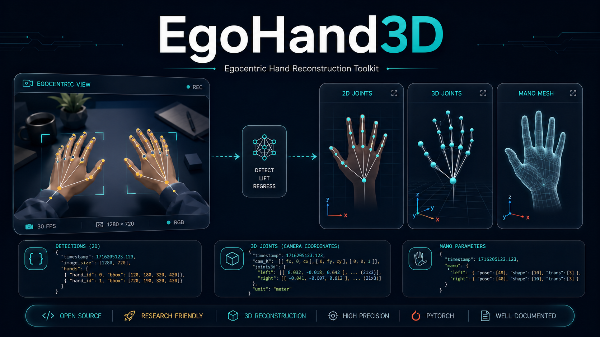

# EgoHand3D

EgoHand3D is an application-layer toolkit for egocentric hand reconstruction,
result export, visualization, evaluation, and training workflow management. It
wraps a WiLoR-based hand reconstruction runtime with practical command-line
tools for first-person images and videos.



## What It Does

- Detect hands in image folders or videos.
- Reconstruct hand meshes and export OBJ files.
- Export 21 projected 2D hand keypoints.
- Export 21 3D hand joints with camera metadata.
- Export MANO pose, shape, and camera parameters.
- Visualize predicted joints and video overlays.
- Evaluate HOI4D-style 2D keypoint predictions.
- Build manifests, result reports, and merged export indexes.
- Validate runtime dependencies and model asset paths.

## Repository Layout

```text
egohand3d/                 application-layer inference, IO, and visualization helpers
tools/                     reporting, video, evaluation, validation, and merge tools
scripts/                   common inference and training shell commands
docs/                      GitHub Pages project website
examples/egocentric_sequence/
                           first-person input frames and matching output files
results/hoi4d/             compact HOI4D evaluation summaries and checkpoint manifest
sample_outputs/            public-safe example outputs for every documented command
detect_and_reconstruct.py  image reconstruction and mesh export entry point
export_2d_joints.py        2D joint export entry point
export_3d_joints.py        3D joint export entry point
export_mano_params.py      MANO parameter export entry point
egohand3d_cli.py           unified CLI wrapper
train.py                   training workflow entry point
```

## External Assets

This repository does not publish model weights, MANO data, datasets, generated
outputs, or software-copyright registration documents by default.

Expected runtime assets:

```text
wilor/ or an installed WiLoR-compatible Python package
pretrained_models/wilor_final.ckpt
pretrained_models/model_config.yaml
pretrained_models/detector.pt
mano_data/MANO_RIGHT.pkl
mano_data/MANO_LEFT.pkl
```

You can provide them as directories, symlinks, or command-line paths:

```bash
ln -s /path/to/WiLoR/wilor wilor
ln -s /path/to/pretrained_models pretrained_models
ln -s /path/to/mano_data mano_data
```

Before publishing this repository publicly, verify whether the vendored
`wilor/` code may be redistributed under its upstream license. If not, replace
it with installation instructions or a Git submodule that points to the original
project.

## Environment

Use the project environment if it already exists:

```bash
source scripts/activate.sh
```

Or create an environment from the portable dependency files:

```bash
conda env create -f environment.yml
conda activate egohand3d
pip install -r requirements.txt
```

Run a lightweight setup check:

```bash
python egohand3d_cli.py validate --image_dir /path/to/images
```

## Quick Start

Mesh reconstruction and overlay:

```bash
python egohand3d_cli.py reconstruct \
  --img_folder /path/to/images \
  --out_folder outputs/demo_mesh
```

Export 2D joints:

```bash
python egohand3d_cli.py export-2d \
  --img_folder /path/to/images \
  --out_folder outputs/2d_joints
```

Export 3D joints:

```bash
python egohand3d_cli.py export-3d \
  --img_folder /path/to/images \
  --out_folder outputs/3d_joints
```

Export MANO parameters:

```bash
python egohand3d_cli.py export-mano \
  --img_folder /path/to/images \
  --out_folder outputs/mano_params
```

Build a processing manifest:

```bash
python egohand3d_cli.py manifest \
  --image_dir /path/to/images \
  --pred_dir outputs/2d_joints \
  --out outputs/manifest.json
```

Merge exported results:

```bash
python egohand3d_cli.py merge \
  --joints2d_dir outputs/2d_joints \
  --joints3d_dir outputs/3d_joints \
  --mano_dir outputs/mano_params \
  --mesh_dir outputs/demo_mesh \
  --out outputs/merged_exports.json
```

## Public Sample Outputs

Every command documented in this README has a matching lightweight result under
[sample_outputs](sample_outputs). The image artifacts use the first-person
example frame and overlays from
[examples/egocentric_sequence](examples/egocentric_sequence), while the compact
JSON/CSV/OBJ files show the expected output schemas without publishing videos,
model weights, or full local experiment dumps.

| Command | Example outputs on GitHub |
| --- | --- |
| `python egohand3d_cli.py validate ...` | [validate_setup.json](sample_outputs/validate/validate_setup.json), [validate_setup.md](sample_outputs/validate/validate_setup.md) |
| `python egohand3d_cli.py reconstruct ...` | [sample_frame_0.obj](sample_outputs/reconstruct/sample_frame_0.obj), [sample_frame_overlay.png](sample_outputs/reconstruct/sample_frame_overlay.png), [summary.json](sample_outputs/reconstruct/summary.json) |
| `python egohand3d_cli.py export-2d ...` | [sample_frame_kpts2d.json](sample_outputs/2d_joints/sample_frame_kpts2d.json), [records.jsonl](sample_outputs/2d_joints/records.jsonl), [summary.json](sample_outputs/2d_joints/summary.json) |
| `python egohand3d_cli.py export-3d ...` | [sample_frame_joints3d.json](sample_outputs/3d_joints/sample_frame_joints3d.json), [records.jsonl](sample_outputs/3d_joints/records.jsonl), [summary.json](sample_outputs/3d_joints/summary.json) |
| `python egohand3d_cli.py export-mano ...` | [sample_frame_mano.json](sample_outputs/mano_params/sample_frame_mano.json), [summary.json](sample_outputs/mano_params/summary.json) |
| `python egohand3d_cli.py video ...` | [frame_000000.json](sample_outputs/video_hands/jsons/frame_000000.json), [frame_000000.png](sample_outputs/video_hands/overlay_frames/frame_000000.png), [summary.json](sample_outputs/video_hands/summary.json) |
| `python egohand3d_cli.py evaluate ...` | [summary.json](sample_outputs/evaluate/summary.json), [summary.csv](sample_outputs/evaluate/summary.csv), [details.csv](sample_outputs/evaluate/details.csv), [sample_frame_eval_overlay.png](sample_outputs/evaluate/overlays/sample_frame_eval_overlay.png) |
| `python egohand3d_cli.py report ...` | [report.md](sample_outputs/report/report.md), [report.json](sample_outputs/report/report.json), [json_files.csv](sample_outputs/report/json_files.csv) |
| `python egohand3d_cli.py manifest ...` | [manifest.json](sample_outputs/manifest/manifest.json), [manifest.csv](sample_outputs/manifest/manifest.csv), [manifest.md](sample_outputs/manifest/manifest.md) |
| `python egohand3d_cli.py merge ...` | [merged_exports.json](sample_outputs/merged_exports/merged_exports.json), [merged_exports.csv](sample_outputs/merged_exports/merged_exports.csv), [merged_exports.md](sample_outputs/merged_exports/merged_exports.md) |
| `python egohand3d_cli.py visualize ...` | [sample_frame_overlay.png](sample_outputs/visualize/sample_frame_overlay.png), [summary.json](sample_outputs/visualize/summary.json) |
| `bash scripts/train_hoi4d_clean_4gpu.sh` and smoke training | [smoke_train_log.txt](sample_outputs/training/smoke_train_log.txt), [expected_training_outputs.json](sample_outputs/training/expected_training_outputs.json) |

The complete command-to-output index is in
[sample_outputs/README.md](sample_outputs/README.md). File hashes are listed in
[sample_outputs/checksums.csv](sample_outputs/checksums.csv).

## First-Person Examples

A real egocentric sample package is included in
[examples/egocentric_sequence](examples/egocentric_sequence). It contains three
`cam0` frames from `../WiLoR/20260604_203918_008` and their matching 2D keypoint
JSON files, raw detection JSON files, 3D trajectory samples, diagnostic overlay
images, mesh overlay previews, manifest files, and checksums.

| Example artifact | Files |
| --- | --- |
| First-person input frames | [inputs/cam0](examples/egocentric_sequence/inputs/cam0) |
| 2D keypoint outputs | [outputs/2d_joints/cam0](examples/egocentric_sequence/outputs/2d_joints/cam0) |
| Raw detection outputs | [outputs/detections/cam0](examples/egocentric_sequence/outputs/detections/cam0) |
| 3D trajectory samples | [outputs/3d_trajectory](examples/egocentric_sequence/outputs/3d_trajectory) |
| Overlay result images | [outputs/overlays/cam0](examples/egocentric_sequence/outputs/overlays/cam0) |
| Mesh overlay previews | [outputs/mesh_previews/cam0](examples/egocentric_sequence/outputs/mesh_previews/cam0) |
| Manifest and checksums | [manifest.json](examples/egocentric_sequence/manifest.json), [checksums.csv](examples/egocentric_sequence/checksums.csv) |

The original video, full trajectory arrays, checkpoints, datasets, and MANO
assets are not included.

## Unified CLI

```text
reconstruct   export OBJ meshes and overlay renderings
export-2d     export projected 2D hand joints
export-3d     export 3D hand joints and camera metadata
export-mano   export MANO pose, shape, and camera parameters
video         detect and visualize hands in a video
evaluate      evaluate 2D joints against HOI4D-style labels
report        build a report for an output directory
manifest      build an image/video processing manifest
merge         merge exported 2D/3D/MANO/mesh files into one index
visualize     draw JSON joints on source images
validate      validate dependencies and required runtime files
```

## Training

Single-node 4 GPU HOI4D clean:

```bash
bash scripts/train_hoi4d_clean_4gpu.sh
```

Multi-node HOI4D clean + EgoDex:

```bash
bash scripts/train_hoi4d_clean_egodex_2x4gpu_volc.sh
```

Manual smoke run:

```bash
python train.py \
  exp_name=smoke_hoi4d_clean_1gpu \
  data=hoi4d_clean \
  experiment=wilor_vit_refinenet \
  trainer=gpu \
  trainer.devices=1 \
  TRAIN.BATCH_SIZE=2 \
  GENERAL.NUM_WORKERS=2 \
  GENERAL.TOTAL_STEPS=20
```

## GitHub Pages

The project website is in `docs/`. After pushing to GitHub, enable Pages from
`Settings -> Pages -> Deploy from a branch -> main /docs`.

You can also open it locally:

```bash
xdg-open docs/index.html
```

## Software Copyright Materials

The local software-copyright registration materials are intentionally ignored by
Git in `.gitignore`. They include application drafts, Word files, official
templates, and private registration notes. Keep them local or upload them only
to a private repository if you explicitly intend to share them.

The public repository can still describe the claim boundary:

- self-developed application-layer Python source: `3214` lines at the time of
  registration preparation;
- third-party model code, pretrained weights, MANO data, datasets, and example
  photos are not claimed as original source code.

See [GITHUB_PUBLISHING.md](GITHUB_PUBLISHING.md) and
[THIRD_PARTY_NOTICES.md](THIRD_PARTY_NOTICES.md) before making the repository
public.

## HOI4D Results

Compact HOI4D result summaries and the local checkpoint manifest are included in
[results/hoi4d](results/hoi4d). Full checkpoint files are not stored directly in
Git because the discovered HOI4D checkpoints are approximately 7.2 GiB each.
Use GitHub Releases with split assets, Hugging Face, or object storage for the
full weights.
